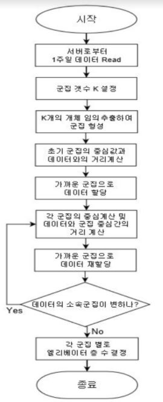
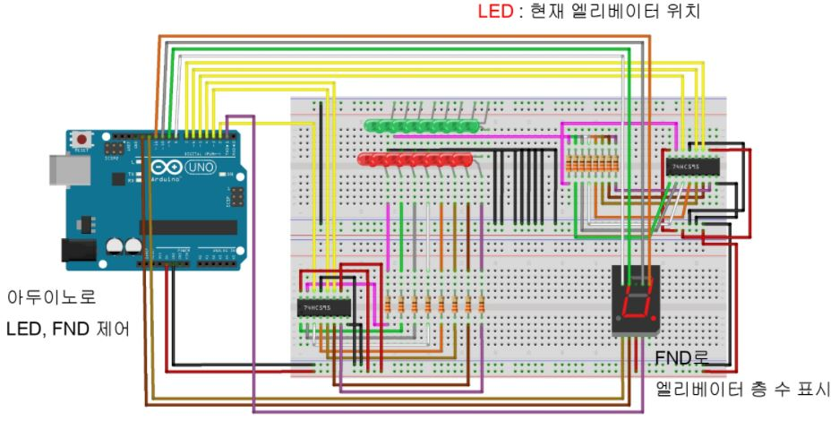
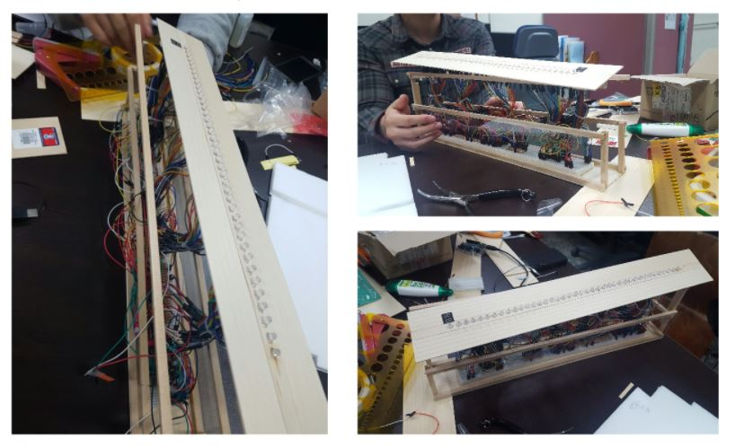
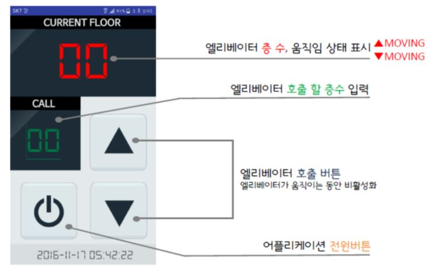
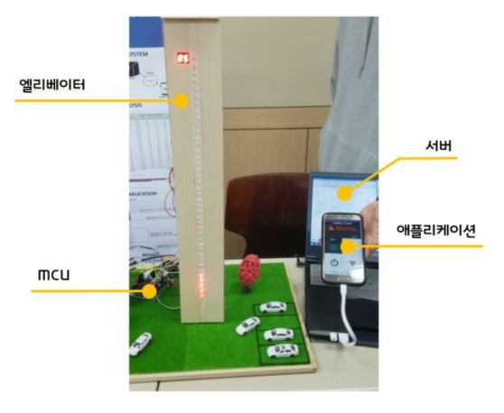

# Elemy_project
클러스터링을 이용하여 엘리베이터의 동선을 최적화시키는 프로그램입니다.
## 프로젝트의 기반이 되는 논문

## 시스템 전개도

* MCU는 엘리베이터 제어유닛과 서버를 이어주는 중계기 역할
* 서버에서 데이터를 수집하고 분석하여 엘리베이터를 자동제어
* 스마트폰 어플리케이션을 통하여 엘리베이터 상태 확인 및 원격제어
## 클러스터링 시스템 알고리즘

clustering_program 파일의 main.c 에 구현되어있다.
## 제작과정

아두이노와 led를 이용해서 엘리베이터 모형을 만들기위한 하드웨어설계

설계도를 실제 제작

엘리베이터 제어 어플리케이션 UI
## 완성

* 서버는 java로 구현
* 어플리케이션은 android로 구현
* 엘리베이터 제어(led)는 arduino로 구현
